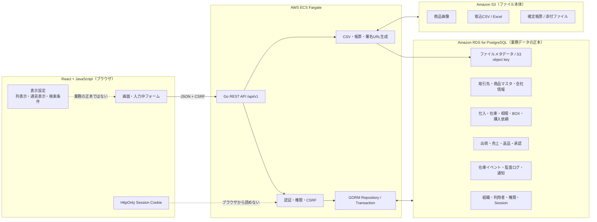
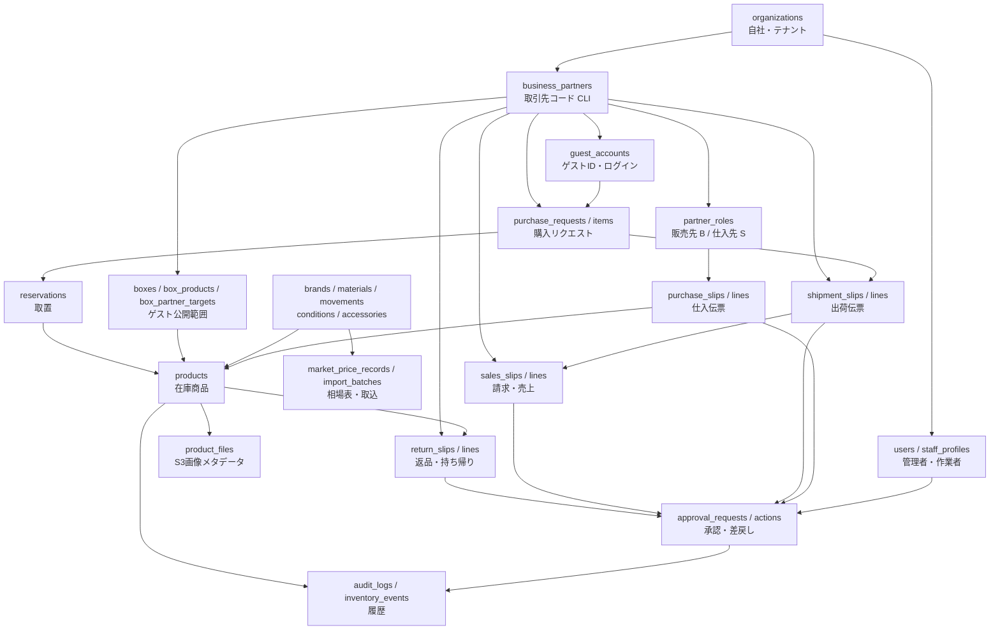

# データ保存先・所有権設計（合意用）

最終構成を React + JavaScript / Go / GORM / PostgreSQL / REST API / Cookie Session / ECS Fargate / RDS / S3 とした場合の、データの正本と保存先を定義する。

この文書は実装確定前の合意資料である。`要確認`の項目は、運用上の理解が異なる場合に訂正する。

## 1. 保存の原則

1. 業務データの正本はRDS PostgreSQLとし、React・`APP_DATA`・`localStorage`を正本にしない。
2. 画像・取込CSV・発行済み帳票などのバイナリ本体はS3へ置き、RDSにはobject key・ファイル名・MIME・サイズ・ハッシュ・作成者を保存する。
3. テーブルの主キーはUUID等の内部IDとし、画面用コードは組織内で一意な変更しないコードとして別に持つ。
4. 外部キーは名称ではなく内部IDで結ぶ。名称・住所はマスタ参照と、確定伝票の履歴用スナップショットを分ける。
5. 金額は金額と通貨を必ず同時に保存する。為替換算には適用した為替スナップショットIDを残す。
6. ステータス変更は現在値だけでなく、イベント・承認・監査ログにも残す。
7. パスワード、session token、CSRF tokenは平文保存しない。
8. `buyer_role_id`から取引先会社を特定できるため、同じ伝票へpartner IDを重複保存しない。APIはJOINして`Bxxx`と`CLI-xxx`の両方を返す。

## 2. 全体の保存先

## 3. 業務データの関係

## 4. 領域別の正本と保存項目

| 領域 | RDSで正本にする主な項目 | S3 | ブラウザだけに置いてよいもの | 現在の主な保存先 |
|---|---|---|---|---|
| 自社・会社情報 | `organizations`: code/name/status、`organization_profiles`: 郵便番号/住所/電話/FAX/email/インボイス番号、`organization_bank_accounts`: 銀行/支店/種別/口座番号/名義 | ロゴ、印影 | 入力中の未保存値 | `APP_DATA.companyInfo` |
| 管理者・作業者 | `users`: login_id/password_hash/display_name/role/status/last_login、`staff_profiles`: staff_code/user_id | 原則なし | ログインフォーム入力 | `APP_DATA.users`、`staffRecords`、`inv_login_directory_v1` |
| Session・権限 | `sessions`: token_hash/csrf_hash/expires_at/ip/user_agent、roles/permissions | なし | HttpOnly Cookie、画面内CSRF token | Go DBと一部ブラウザデモ認証 |
| 共通取引先 | `business_partners`: partner_code=`CLI-xxx`/法人名/代表者/担当者/email/電話/住所/インボイス番号/status | 契約書等を扱う場合のみ | 取引先検索条件 | `clientCompanies`、`inv_client_company_directory_v1` |
| 販売先・仕入先区分 | `partner_roles`: partner_id/role_type=`buyer\|supplier`/role_code=`Bxxx\|Sxxx`/有効期間 | なし | なし | `buyers`、`suppliers`が別配列 |
| ゲスト | `guest_accounts`: guest_code/user_id/buyer_role_id/status。会社はbuyer roleから参照し、全ログイン資格は`users`へ統一 | なし | ゲストのカート（短期） | `guestAccounts`、平文password、`inv_login_directory_v1` |
| 商品マスタ | brands/materials/movements/conditions/accessoriesの各code/name/status/sort_order | なし | 検索条件 | 個別localStorage、名称互換配列も併存 |
| 仕入担当者 | `staff_profiles.staff_code`から`users.id`へ連携 | なし | 選択中担当者 | `staffRecords`と`users`を画面で同期 |
| 仕入伝票 | `purchase_slips`: slip_number/supplier_role_id/purchase_date/status/note/created_by、`purchase_slip_lines`: line_no/qty/unit_cost/currency/商品入力値 | 確定帳票を保存する場合 | 入力中の未保存明細 | `purchaseSlips`、`inv_business_workflow_v1` |
| 在庫商品 | `products`: product_code/SKU/brand_id/model/ref/serial/supplier_role_id/staff_id/仕入価格+通貨/基準売価+通貨/status/condition_id/note、付属品は中間表 | 商品画像 | 表の列表示、検索・ソート | `inventory`。一部はブラウザ再読込で消失 |
| 在庫履歴 | `inventory_events`: product_id/from_status/to_status/event_type/原因/actor/time | なし | なし | 現在値の直接変更と一部`revisions` |
| 商品コード連番 | `product_code_sequences`: organization_id/business_date/last_sequence。DB transactionで採番 | なし | なし | `itemNumberByDate` |
| 相場表 | `market_price_records`: import_date/brand_id/model/ref/condition_id/仕入価格JPY/相場価格USD/source/import_batch_id/created_by | 元CSV・Excel | 取込前プレビュー | `marketPrices`。編集・取込はブラウザ中心 |
| 為替 | `exchange_rate_snapshots`: base/quote/rate/observed_at/provider/created_by。取引行はsnapshot_idを参照 | なし | 表示通貨の選択 | `fxRates` |
| BOX公開 | boxes、box_products、box_partner_targets。閲覧時に在庫statusを必ず照合 | BOX用画像は商品画像を参照 | 管理画面のチェック途中状態 | `boxes`、`inv_guest_box_draft_v1`、`publishedSnapshot` |
| ゲストカート | 永続化が必要ならguest_carts/cart_items。現段階は保存不要 | なし | `guest_cart_<guestId>` | localStorage |
| 購入リクエスト | `purchase_requests`: request_number/guest_account_id/buyer_role_id/status/note/requested_at、`purchase_request_items`: product_id/request_price+currency/item_status。取引先コードはbuyer roleから取得 | 添付がある場合のみ | 送信前の入力 | `purchaseRequests`、`inv_purchase_requests_v1` |
| 取置 | `reservations`: request_item_id/product_id/status/starts_at/expires_at/released_at | なし | なし | inventoryの一時メタデータと購入依頼 |
| 出荷伝票 | `shipment_slips`: shipment_number/buyer_role_id/request_id/date/status/address_snapshot/note、linesはproduct_id/qty | 通関書類・確定出荷伝票 | 入力中明細 | `shipments`。現在はdestinationコード中心 |
| 売上・請求書 | `sales_slips`: sales_number/buyer_role_id/source_shipment_id/date/status/tax_mode/partner_snapshot、linesはproduct_id/unit_price/currency/fx_snapshot_id | 確定請求書 | 円/ドルの表示切替 | `sales`。buyerコードはあるが取引先FKなし |
| 返品・持ち帰り | `return_slips`: return_number/return_type/source_sales_id/partner_id/status/date/reason、linesはproduct_id/amount/currency | 返品書類 | 入力中判定 | `salesReturns`、`purchaseReturns`、売上明細内フラグが併存 |
| 承認 | approval_requests/actions: target_type/target_id/action/status/requested_by/decided_by/before/after/reason/time | 添付がある場合 | なし | `approvalRequests`、`inv_approval_workflow_v2` |
| 通知 | notifications: recipient_user_id/type/target_type/target_id/read_at/created_at | なし | 一時トースト | `notifications` |
| ダッシュボード | 金額・件数は伝票と在庫から都度集計。目標値だけorganization_settingsへ保存 | なし | 表示通貨 | 実伝票集計＋`dashboardSettings` |
| 監査 | audit_logs: actor/target/action/before/after/result/request_id/ip/time。更新・削除禁止 | 大容量証跡のみ必要時 | なし | Go DBに一部実装、参照画面の変更履歴は分散 |

## 5. 共通取引先の推奨構造

販売先と仕入先は別会社テーブルにせず、会社本体と取引区分を分離する。

| テーブル | 重要項目 | 意味 |
|---|---|---|
| `business_partners` | `id`, `organization_id`, `partner_code`, `legal_name`, `invoice_number`, `address`, `phone`, `email`, `status` | 会社そのもの。`CLI-xxx`はここで固定 |
| `partner_roles` | `id`, `partner_id`, `role_type`, `role_code`, `is_active` | 販売先なら`Bxxx`、仕入先なら`Sxxx`。同じ会社が両方を持てる |
| `guest_accounts` | `id`, `guest_code`, `user_id`, `buyer_role_id`, `status` | ゲストログインと販売先roleを固定IDで結び、会社はroleから取得 |
| `partner_contacts` | `id`, `partner_id`, `name`, `department`, `email`, `phone`, `is_primary` | 担当者が複数になる場合に使用 |

名称変更は`legal_name`だけを更新し、`partner_code`、`partner_id`、`role_code`は変更しない。確定済み伝票には当時の宛名・住所・インボイス番号をsnapshotとして残す。

## 6. ファイル保存ルール

| 種類 | S3 object key例 | RDSメタデータ |
|---|---|---|
| 商品画像 | `organizations/{orgId}/products/{productId}/{fileId}.jpg` | product_id/object_key/original_name/content_type/size/hash/sort_order |
| 相場取込元 | `organizations/{orgId}/market-imports/{batchId}/source.csv` | batch_id/object_key/file_name/hash/row_count/status |
| 確定請求書 | `organizations/{orgId}/sales/{salesId}/invoice-v1.pdf` | document_type/target_id/version/object_key/hash/issued_at/issued_by |
| 出荷・通関書類 | `organizations/{orgId}/shipments/{shipmentId}/{documentId}.pdf` | 同上 |
| 承認添付 | `organizations/{orgId}/approvals/{approvalId}/{fileId}` | approval_id/object_key/file metadata |

DBには一時的な署名URLを保存せず、S3 object keyを保存してGo APIが都度署名URLを発行する。

## 7. REST APIの境界

| API群 | 主な処理 | 必須トランザクション |
|---|---|---|
| `/api/v1/masters/*` | ブランド等の固定マスタ | 参照中コードの削除防止 |
| `/api/v1/partners` | 共通取引先・販売先/仕入先role・ゲスト発行 | partner + role + guest/userを一括確定 |
| `/api/v1/purchases` | 仕入伝票確定、商品コード採番、在庫生成 | slip + lines + products + events |
| `/api/v1/market-imports` | S3取込、検証、承認、相場反映 | batch + rows + records + audit |
| `/api/v1/boxes` | BOX商品・公開先設定 | box + targets + products |
| `/api/v1/purchase-requests` | ゲスト申請、商品承認、取置 | request + items + reservation + product status |
| `/api/v1/shipments` | 出荷確定 | shipment + lines + reservation fulfilled + product status |
| `/api/v1/sales` | 売上・請求確定 | sales + lines + fx snapshot + product status |
| `/api/v1/returns` | 返品・持ち帰り確定 | return + lines + product status/event |
| `/api/v1/approvals` | 申請・承認・差戻し・実行 | approval + action + target update + audit |

## 8. 現在の実装と本番保存設計の差分

通常画面の業務データ、bcrypt認証、固定コード、購入依頼・取置、共通取引先、マスタ参照、BOXライブ公開、返品、追跡番号、採番、通知、会社情報、CSV・帳票履歴はGo APIとPostgreSQLへ統一済みである。React内の`APP_DATA`はAPIレスポンスから作る表示用投影であり正本ではない。AWSを使わずに完了できる範囲はここまでローカル実装した。

| 優先度 | 現在のローカル代替 | AWS／本番で行う内容 |
|---|---|---|
| 高 | 商品画像はローカルファイル、RDS相当のメタデータはPostgreSQL | `ZAIKO_STORAGE_DRIVER=s3`へ切替し、暗号化・署名URL・削除整合性を確認 |
| 高 | Cookie SessionをPostgreSQLで共有 | Secrets Manager、HTTPS、Secure Cookie、本番失効運用を確認 |
| 中 | メールはDB送信待ちキューまで | SES配送ワーカー、再送、バウンス、監視を接続 |
| 中 | 帳票はブラウザ印刷、発行履歴はPostgreSQL | 確定PDFを生成する場合はS3へ固定保存しobject keyを履歴へ記録 |
| 中 | 主要操作を監査済み | 補助表示設定を含む監査網羅と保持期間を確定 |
| 要確認 | USD金額を整数の最小管理単位で保存 | セント対応要否を業務決定し、必要なら全APIと移行データを統一 |

## 9. 訂正・合意が必要な項目

以下は実装前に業務判断を確定する。

1. `要確認` 販売価格USDは1ドル単位でよいか、セントまで必要か。
2. `要確認` 同じ会社が販売先と仕入先の両方になる運用を正式に許可するか。
3. `要確認` 取引先の社名・住所変更後も、確定済み帳票は発行当時の内容を維持するか（推奨: 維持）。
4. `要確認` ゲストカートを端末間で共有する必要があるか（不要ならブラウザのみ）。
5. `要確認` 取置の自動期限と、期限切れ後の再公開ルール。
6. `要確認` 出荷確定と売上確定の順番を必須にするか、直売上を許可するか。
7. `要確認` 持ち帰りは売上取消、返品、委託返却のどの会計処理になるか。
8. `要確認` 相場取込の重複キー（オークション名、開催日、lot番号、商品識別情報等）。
9. `要確認` 発行済み請求書・出荷伝票をS3へ固定保存するか、毎回DBから再生成するか（推奨: 確定版を保存）。
10. `要確認` Cookie SessionをRDSだけで運用開始するか、規模に応じてElastiCacheへ分離するか。

## 10. 保存しないもの

- Reactコンポーネントのstate、`APP_DATA`表示投影、モーダル開閉、選択中タブ
- 一覧の一時検索文字、ページ番号、ソート（ユーザー設定として必要な場合を除く）
- S3署名URL
- パスワード平文、session token平文、CSRF token平文
- ダッシュボードの集計結果そのもの（キャッシュ導入時を除く）
- マスタから再取得できる表示名称だけの重複コピー。ただし確定帳票の履歴snapshotは例外
