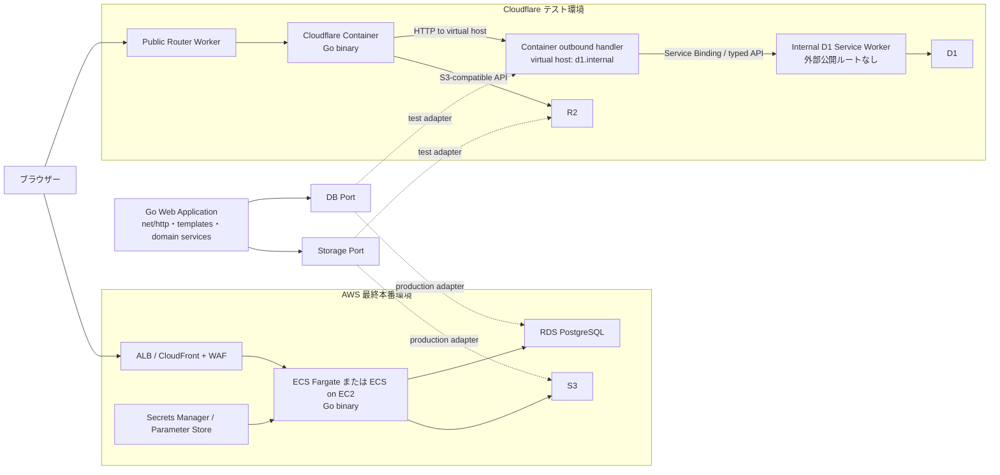

# DB/API プラットフォームアーキテクチャ

- ステータス: Accepted（2026-07-30、推奨構成で進行）
- 作成日: 2026-07-30
- 対象: 在庫管理システム
- 本番環境: AWS
- 検証環境: Cloudflare D1 / R2 / Containers

## 1. 目的

現行の Go アプリケーションを維持しながら、DB とオブジェクトストレージを交換可能にし、次の二つの環境を安全に検証・運用できる構成を定義する。

1. Cloudflare 上で D1、R2、Containers の適合性を検証するテスト環境
2. AWS 上で可用性、永続性、バックアップ、運用性を確保する最終本番環境

Cloudflare は本番基盤ではない。Cloudflare 固有機能をドメイン層や HTTP ハンドラーへ直接浸透させず、AWS 本番への切替を妨げないことを最優先とする。

## 2. 現行 Go 実行方式

現行システムは静的サイトではなく、単一のネイティブ Go プロセスで動作するサーバーサイド Web アプリケーションである。

- `cmd/server/main.go` が設定を読み込み、DB を開き、マイグレーションを実行して `http.Server.ListenAndServe` を開始する。
- `internal/web/server.go` が `http.NewServeMux` に画面、フォーム、CSV、画像、認証などのルートを登録する。
- HTML テンプレート、CSS、JavaScript は `go:embed` で実行バイナリへ埋め込まれる。
- DB は `modernc.org/sqlite` と `database/sql` を利用し、ローカル SQLite ファイルへ接続する。
- DB 起動時に `foreign_keys`、`busy_timeout`、`journal_mode=WAL` を設定し、多数の業務処理が `BeginTx` に依存する。
- 商品画像はローカルの `ZAIKO_UPLOAD_DIRECTORY` 以下へ保存され、DB には `storage_path` が登録される。
- セッションも DB に保存される。

したがって、現行バイナリを Cloudflare Pages や Workers の Fetch ハンドラーとして直接動かすことはできない。Cloudflare で Go を維持する検証では Containers を実行基盤とし、D1 と R2 へのアクセスは明示的なアダプターを介する。

## 3. 目標構成



図中の `GoApp`、`DB Port`、`Storage Port` は論理構造であり、Cloudflare と AWS で同じドメインサービスと HTTP ハンドラーを利用する。環境差分は composition root でアダプターを選択して吸収する。公開 Router Worker と内部 D1 Service Worker は別コンポーネントとし、D1 binding は内部 Service Worker だけに付与する。

## 4. Cloudflare テスト構成

### 4.1 実行基盤

Go バイナリを Linux AMD64 コンテナとしてビルドし、Cloudflare Container で起動する。前段の Worker は、固定した Container instance ID へ HTTP リクエストをルーティングする。

検証環境の Container は次の条件を満たす必要がある。

- リッスンアドレスは `0.0.0.0:<port>` とする。
- ローカルディスクを永続ストレージとして扱わない。
- SQLite ファイル、セッション、商品画像を Container ディスクへ永続化しない。
- 複数 Container が独立 DB を持つ構成にしない。
- 起動時マイグレーションを複数インスタンスから同時実行しない。
- Container の sleep、restart、rolling deploy 後もデータが失われないことを試験する。

### 4.2 D1

D1 は Container から直接バインドできる `database/sql` ドライバーではない。Container は
`http://d1.internal` という仮想ホストへ型付き HTTP リクエストを送信し、Container を管理する
Worker の outbound handler がその通信を捕捉する。outbound handler は D1 を直接操作せず、
Service Binding を通して、D1 binding を保持する専用の内部 D1 Service Worker を呼び出す。
内部 Worker に route / custom domain / `workers.dev` 公開は設定しない。外部公開 HTTP URL への
フォールバックも設けない。

```text
Go Container
  -> http://d1.internal typed application request
  -> Container outbound handler
  -> Service Binding
  -> D1 API Worker
  -> D1 binding
  -> typed application response
```

D1 API Worker は汎用 SQL プロキシにしてはならない。SQL 文、テーブル名、任意の WHERE 条件をクライアントから受け取らず、業務ユースケース単位のエンドポイントだけを公開する。

D1 API Worker に外部公開ルートは設定しない。公開 Router Worker には D1 binding を付与せず、
内部 Worker への Service Binding だけを付与する。Container の outbound policy は deny by
default とし、`d1.internal` と、R2 S3 API を利用する場合のテスト専用 endpoint だけを許可する。
両 Worker の binding、secret、デプロイ権限を分離して最小権限を維持する。

例:

- `POST /internal/v1/products`
- `GET /internal/v1/products/{id}`
- `POST /internal/v1/sales`
- `POST /internal/v1/stocktakes/{id}/complete`
- `POST /internal/v1/sessions`
- `DELETE /internal/v1/sessions/{tokenHash}`

複数更新を原子的に行う処理は、一回の API 呼び出しで Worker 側へ必要な入力を渡し、D1 の batch または対応する一貫性境界の中で完結させる。Go から複数の D1 API 呼び出しを行って一つのトランザクションとみなしてはならない。

D1 は Cloudflare 適合性を検証するためのテスト DB であり、AWS 本番 DB の正本にはしない。D1 と本番 RDS の常時双方向同期は行わない。

### 4.3 R2

R2 は S3 互換 API を使用して Go Container から直接接続する。AWS SDK for Go v2 の S3 clientを共通アダプター内部で利用し、環境設定で endpoint、region、bucket、credentials を切り替える。

テスト環境では次の設定を使用する。

- endpoint: `https://<ACCOUNT_ID>.r2.cloudflarestorage.com`
- region: `auto`
- bucket: テスト専用
- credentials: テスト専用の最小権限 S3 API token
- object key: organization ID と product ID を含む非推測 ID

R2 を FUSE マウントして SQLite ファイルを保存してはならない。R2 は商品画像、CSV、将来の帳票などのオブジェクト専用とする。

### 4.4 テストデータ

- 本番データをそのまま D1/R2 へ複製しない。
- 個人情報、認証情報、取引先連絡先、シリアル番号は匿名化または合成データへ置換する。
- テスト用 organization、user、guest、商品、伝票を明示的に識別する。
- D1/R2 の削除と再作成で再現できる seed/export/import 手順を持つ。

## 5. AWS 最終本番構成

### 5.1 推奨サービス

| 関心 | 推奨 AWS サービス | 備考 |
|---|---|---|
| Go 実行 | ECS Fargate | コンテナ化した同一 Go バイナリを実行する |
| 入口 | ALB | TLS 終端、ヘルスチェック、ルーティング |
| CDN/WAF | CloudFront + AWS WAF | 必要性を評価して ALB 前段へ配置 |
| DB | RDS for PostgreSQL | Multi-AZ、PITR、暗号化を有効化 |
| 画像/帳票 | S3 | Versioning、暗号化、lifecycle を設定 |
| Secret | Secrets Manager | DB password、cookie secret、外部 API secret |
| 設定 | SSM Parameter Store | 非機密設定 |
| ログ/メトリクス | CloudWatch | application log、ALB log、alarm |
| コンテナイメージ | ECR | digest 固定でデプロイ |
| DNS/TLS | Route 53 + ACM | 本番ドメインと証明書 |

SQLite を EFS 上へ配置して複数 ECS task から共有する案は採用しない。ファイルロック、WAL、障害復旧、水平スケールのリスクを避けるため、本番 DB は PostgreSQL とする。

### 5.2 可用性と永続性

- ECS task は最低 2 台を異なる AZ に配置できる構成とする。
- RDS は Multi-AZ、暗号化、削除保護、自動バックアップ、PITR を有効にする。
- S3 は server-side encryption、Versioning、必要な lifecycle rule を有効にする。
- DB migration は application 起動時の全 task 実行ではなく、単一の migration job としてデプロイ前に実行する。
- migration failure 時は新 application revision の rollout を中止する。
- `/healthz` は process liveness、別の readiness check は DB/必須依存への接続可否を判定する。
- rollback は旧 ECS task definition と後方互換 migration を前提とする。

## 6. 交換可能な DB ポート

### 6.1 原則

ドメインサービスは `database/sql`、SQLite、D1、PostgreSQL、HTTP clientを直接参照しない。ユースケースに必要な操作を表現した小さいインターフェースへ依存する。

一つの巨大な `Store` インターフェースや、次のような汎用 SQL ポートは禁止する。

```go
// 禁止例
type Database interface {
    Query(ctx context.Context, sql string, args ...any) ([]map[string]any, error)
}
```

推奨する境界の例:

```go
type ProductRepository interface {
    FindProduct(ctx context.Context, organizationID, productID string) (Product, error)
    SearchProducts(ctx context.Context, query ProductSearch) ([]Product, error)
    CreateProduct(ctx context.Context, command CreateProductCommand) (Product, error)
    UpdateProduct(ctx context.Context, command UpdateProductCommand) (Product, error)
}

type SalesRepository interface {
    CreateSale(ctx context.Context, command CreateSaleCommand) (Sale, error)
    ConfirmSale(ctx context.Context, command ConfirmSaleCommand) error
    CreateSalesReturn(ctx context.Context, command CreateSalesReturnCommand) (SalesReturn, error)
}

type SessionRepository interface {
    CreateSession(ctx context.Context, session Session) error
    FindSession(ctx context.Context, tokenHash string) (Session, error)
    DeleteSession(ctx context.Context, tokenHash string) error
}
```

ポートは現在の SQL テーブル単位ではなく、整合性を維持すべき業務操作単位で定義する。トランザクション境界も repository 実装の内部へ閉じ込める。

### 6.2 DB アダプター

| 環境 | アダプター | 接続 |
|---|---|---|
| ローカル | SQLite adapter | `database/sql` + local file |
| Cloudflare テスト | D1 API adapter | Cloudflare service binding + application-specific internal Worker API |
| AWS 本番 | PostgreSQL adapter | `database/sql` または `pgx` + RDS |

すべてのアダプターは共通の contract test を通す。最低限、正常系、not found、unique conflict、optimistic conflict、認可境界、rollback、時刻/金額/NULL の変換を検証する。

## 7. 交換可能な Storage ポート

推奨インターフェース:

```go
type ObjectMetadata struct {
    Key         string
    ContentType string
    Size        int64
    ETag        string
}

type ObjectStorage interface {
    Put(ctx context.Context, key string, body io.Reader, size int64, contentType string) (ObjectMetadata, error)
    Get(ctx context.Context, key string) (io.ReadCloser, ObjectMetadata, error)
    Delete(ctx context.Context, key string) error
}
```

| 環境 | 実装 |
|---|---|
| ローカル | Filesystem storage |
| Cloudflare テスト | S3-compatible R2 storage |
| AWS 本番 | S3 storage |

R2 と S3 の差分は endpoint、region、credential provider、checksum/feature compatibility に限定し、ハンドラーへ条件分岐を置かない。

画像登録は次の順序と補償処理を定義する。

1. content type、size、画像形式を検証する。
2. 推測困難な確定 object key へ upload する。
3. DB transaction で metadata を登録する。
4. DB 登録に失敗した場合は object を削除する。
5. 削除失敗は監視対象の orphan として記録し、定期 cleanup する。

画像削除は DB の参照状態と公開 snapshot の有無を確認し、先に論理削除、後で object cleanup を行う方式を優先する。

## 8. D1 Worker API 境界

### 8.1 通信仕様

- Cloudflare service binding の Fetch API を使用し、外部公開 HTTPS/HTTP ルートは設けない。
- JSON request/response。
- API version を URL に含める。
- request ID と idempotency key を受け付ける。
- 金額は整数、日時は UTC の RFC 3339、日付は `YYYY-MM-DD` とする。
- error response は `code`、`message`、`request_id` を持つ。
- SQL 文や内部テーブル名を response へ露出しない。
- pagination、最大件数、payload size limit を固定する。

### 8.2 認証・認可

- Container と内部 D1 Service Worker 間は Cloudflare service binding のみに限定する。
- Cloudflare account API token をアプリケーション request の認証に流用しない。
- Worker は organization ID をクライアント入力だけで信頼せず、認証された service identity と request scope を照合する。
- 各 endpoint は許可された SQL と操作だけを実行する。

### 8.3 信頼性

- mutation は idempotency key で重複実行を防ぐ。
- timeout、指数 backoff、最大 retry 回数を固定する。
- validation error、conflict、not found、dependency timeout を区別する。
- retry は冪等な read、または idempotency が保証された mutation に限定する。
- Worker と Go の双方で request ID をログへ記録する。
- D1 API が利用不能な場合、業務更新をローカル SQLite へ勝手にフォールバックしない。

## 9. 段階移行

### Stage 0: ベースライン固定

- 現行 DB schema、migration、データ件数、主要業務フローを記録する。
- SQLite の backup/restore を検証する。
- 主要ユースケースの結合テストを固定する。
- 本番データを使わない Cloudflare 検証データセットを準備する。

### Stage 1: ポート抽出

- HTTP handler と domain service から具体的な SQLite Store を分離する。
- Product、Purchase、Sales、Shipment、Return、Stocktake、Session などの小さい DB ポートを定義する。
- ObjectStorage ポートを定義する。
- 現行 SQLite/filesystem adapter で既存挙動を維持する。
- contract test を追加する。

### Stage 2: R2/S3 adapter

- 共通 S3-compatible adapter を実装する。
- ローカル、R2、S3 の設定切替を composition root へ限定する。
- upload、download、authorization、compensation、orphan cleanup を試験する。
- Cloudflare テスト環境では R2、AWS staging では S3 で同じ contract test を実行する。

### Stage 3: D1 API adapter

- 低リスクの read-only use case から D1 Worker API を実装する。
- 次に単一 aggregate の mutationを実装する。
- 複数テーブル transaction が必要な業務処理は Worker 内で完結させる。
- SQLite adapter と D1 adapter の contract result を比較する。
- D1 固有の制約がドメイン仕様と衝突した場合は、D1 に合わせて本番仕様を変更しない。

### Stage 4: PostgreSQL adapter

- PostgreSQL 用 schema/migration を作成する。
- SQLite 固有 SQL、PRAGMA、日付、boolean、NULL、foreign key、unique 制約を変換する。
- transaction isolation、lock、concurrent update を試験する。
- SQLite から PostgreSQL への一方向 migration tool と reconciliation report を作成する。

### Stage 5: Cloudflare 統合試験

- Container sleep/restart/rolling deploy。
- D1/R2 failure、latency、timeout、rate limit。
- session、画像、CSV、伝票、在庫確定の整合性。
- D1 と R2 のデータを破棄・再作成できること。
- Cloudflare テスト終了後に本番 AWS 設計へ Cloudflare 固有依存が漏れていないこと。

### Stage 6: AWS staging と本番移行

- ECS/RDS/S3 staging で負荷・障害・backup/restore 試験を行う。
- maintenance window、read-only window、export/import、差分照合、DNS切替、rollback を手順化する。
- migration job成功後に ECS revision を rolloutする。
- 本番移行後は旧 SQLite を直ちに削除せず、暗号化して規定期間保管する。

## 10. セキュリティ

### 10.1 共通

- production、staging、Cloudflare test の account、DB、bucket、secret を分離する。
- secret を repository、Docker image、Wrangler 設定の平文へ保存しない。
- cookie は `Secure`、`HttpOnly`、適切な `SameSite` を使用する。
- password hash、session token hash、CSRF、authorization を環境移行後も維持する。
- upload は content sniffing、size limit、extension allowlist、object key normalization を行う。
- CSV/帳票ダウンロードは organization と権限を再確認する。
- log へ password、session token、API token、画像内容、個人情報を出力しない。

### 10.2 Cloudflare

- D1 binding と R2 token はテスト専用、最小権限、定期 rotation とする。
- D1 API Worker は外部公開ルートを持たせず、Container から service binding でのみ到達可能にする。
- preview account の固定 password を Cloudflare test へ持ち込まない。
- R2 bucket を原則 private とし、認可された backend 配信または短命署名 URL を使用する。

### 10.3 AWS

- ECS task role へ対象 S3 prefix だけの権限を付与する。
- RDS は private subnet に配置し、security group で ECS からだけ許可する。
- S3 Block Public Access を有効化する。
- KMS key の必要性と運用責任を決める。
- CloudTrail、GuardDuty、AWS Config、Security Hub の採用範囲を本番前に決定する。
- backup/restore 権限と application runtime 権限を分離する。

## 11. 停止条件

次のいずれかを検出した時点で、その段階の実装または移行を停止し、設計判断へ戻る。

### Cloudflare テスト停止条件

- Container の一時ディスクへ永続 DB または唯一の画像コピーを置く設計になった。
- R2 FUSE 上で SQLite を運用する必要が生じた。
- 任意 SQL を受け取る D1 API が必要になった。
- 一つの業務 transaction が複数 HTTP request に分断され、atomicity を証明できない。
- D1 と SQLite/RDS の dual-write が必要になり、整合性・recovery 手順を証明できない。
- 本番データまたは本番 secret が Cloudflare test へ流入する。
- Cloudflare 固有制約に合わせて本番業務仕様を変更しようとしている。

### AWS 本番移行停止条件

- PostgreSQL contract test が SQLite の主要結果と一致しない。
- migration の件数、金額、在庫数、伝票状態、session/権限の照合に不一致がある。
- RDS restore と S3 object recovery が未検証。
- rollback 手順と責任者が確定していない。
- migration が複数 ECS task から同時実行される。
- production secret が image、source、log に含まれる。
- load test、failure test、security review の重大指摘が未解決。

## 12. ADR

### ADR-001: AWS を最終本番、Cloudflare をテスト環境とする

- 決定: 採用
- 理由: 現行 Go/net/http を維持しつつ、AWS の永続 RDB、オブジェクトストレージ、可用性、バックアップ機能を本番に利用する。Cloudflare は D1/R2/Containers の技術適合性評価に限定する。
- 影響: Cloudflare test の制約を本番要件として扱わない。Cloudflare と AWS の同時 active-active は対象外。

### ADR-002: DB と Storage をポート/アダプターで交換可能にする

- 決定: 採用
- 理由: SQLite、D1 API、PostgreSQL、および filesystem、R2、S3 の差分をドメインと HTTP handler から隔離する。
- 影響: 既存の巨大 Store をユースケース単位へ段階的に分割し、contract test が必要になる。

### ADR-003: D1 は専用 Worker API 経由で利用する

- 決定: 採用
- 理由: D1 binding は Workers runtime API であり、Go `database/sql` と互換ではない。組込 REST API はアプリケーションの主要 request path には使用しない。
- 影響: Worker API、認証、versioning、idempotency、error model の実装が必要になる。

### ADR-004: 汎用 SQL プロキシを作らない

- 決定: 採用
- 理由: 任意 SQL の公開は認可、秘密情報、SQL injection、schema coupling、transaction 境界の重大リスクを持つ。
- 影響: D1 endpoint は業務ユースケース単位で追加する。

### ADR-005: Cloudflare Container のローカルディスクを永続化に使わない

- 決定: 採用
- 理由: Container のディスクは ephemeral で、sleep/restart 後に保持されない。
- 影響: DB は D1 API、オブジェクトは R2 を利用する。R2 FUSE 上の SQLite は禁止する。

### ADR-006: AWS 本番 DB は PostgreSQL とする

- 決定: 採用
- 理由: 複数 task、transaction、backup/PITR、可用性、運用監視を安定して提供する。
- 影響: SQLite 固有 SQL と migration の変換、データ移行、contract test が必要になる。

### ADR-007: R2 と S3 は同一 S3-compatible Storage adapter 系統を使う

- 決定: 採用
- 理由: Go から両方へ AWS SDK for Go v2 で接続でき、環境差分を設定へ閉じ込められる。
- 影響: checksum、presigned URL、metadata などの互換差分を共通最小機能へ限定する。

### ADR-008: D1 と RDS を常時 dual-write しない

- 決定: 採用
- 理由: 分散 transaction がなく、不一致、retry、partial failure の運用負担が大きい。
- 影響: Cloudflare は独立した合成テストデータを使い、本番移行は一方向 export/import と照合で行う。

## 13. 受入基準

- 既存画面と業務ルールを維持したまま SQLite/filesystem adapter で動作する。
- Cloudflare test では Container restart 後も D1/R2 データが維持される。
- AWS staging では複数 ECS task が同じ RDS/S3 の正本を安全に利用できる。
- DB adapter と Storage adapter が共通 contract test を通過する。
- D1 API に任意 SQL endpoint が存在しない。
- Cloudflare test に本番データと本番 secret が存在しない。
- migration、backup、restore、rollback、reconciliation の手順と実行責任者が確定している。
- 停止条件に該当する未解決事項がない。

## 14. 参考資料

- 現行エントリーポイント: `cmd/server/main.go`
- 現行設定: `internal/config/config.go`
- 現行 SQLite 初期化・migration: `internal/database/database.go`
- 現行 routing・template/static 配信: `internal/web/server.go`
- 現行商品画像保存: `internal/web/inventory_handlers.go`
- Cloudflare Containers: <https://developers.cloudflare.com/containers/>
- Cloudflare Containers lifecycle: <https://developers.cloudflare.com/containers/platform-details/architecture/>
- Cloudflare D1 Workers Binding API: <https://developers.cloudflare.com/d1/worker-api/>
- D1 proxy Worker tutorial: <https://developers.cloudflare.com/d1/tutorials/build-an-api-to-access-d1/>
- Cloudflare R2 AWS SDK for Go: <https://developers.cloudflare.com/r2/examples/aws/aws-sdk-go/>
- Amazon ECS: <https://docs.aws.amazon.com/AmazonECS/latest/developerguide/Welcome.html>
- Amazon RDS for PostgreSQL: <https://docs.aws.amazon.com/AmazonRDS/latest/UserGuide/CHAP_PostgreSQL.html>
- Amazon S3: <https://docs.aws.amazon.com/AmazonS3/latest/userguide/Welcome.html>
