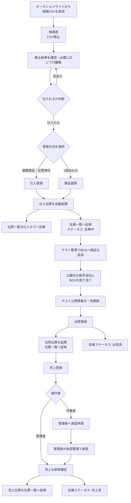

# 相場取込から売上確定までの実務操作

この手順書は、ローカル管理画面 `http://127.0.0.1:8080/app/` で、相場表の取込から仕入・在庫・ゲスト公開・出荷・売上までを一連で処理するための管理者／作業者向け手順です。

## 全体フロー

## 役割別の操作範囲

| 工程 | 管理者 | 作業者 |
|---|---|---|
| 相場CSV取込・相場表確認 | 操作可能 | 操作可能 |
| 仕入登録・商品登録 | 操作可能 | 操作可能 |
| 在庫一覧の確認 | 操作可能 | 操作可能 |
| ゲスト管理・BOX公開 | 操作可能 | 管理者パスワード認証後に操作可能 |
| 出荷登録 | 即時登録 | 即時登録 |
| 売上登録 | 即時確定 | 承認待ちで登録し、管理者へ申請 |
| 売上承認 | 承認管理から承認／差戻し | 自分の申請結果を確認 |

## 管理者の操作手順

### 1. 相場表データを取り込む

1. オークションサイトから落札・出品データをCSVで取得します。
2. 左メニューの「相場表」を開き、「CSV取込」を押します。
3. CSVの列を確認して取り込みます。形式が不明な場合は画面の「テンプレート」から見本CSVを取得し、見出しを合わせます。
4. 取込後、相場表の取込日付、ブランド、モデル、型番、シリアル、仕入価格、相場価格を確認します。
5. 修正が必要な行は、右端の編集ボタンからポップアップを開いて変更します。

### 2. 仕入判断後に商品を登録する

複数商品をまとめて登録するときは「仕入登録」を使います。

1. 仕入日、仕入先、担当者を入力します。
2. 必要な行数を半角数字で入力して「明細追加」を押します。
3. 各行のSKU、仕入金額、売価を入力し、必要に応じて商品登録ポップアップで詳細を補います。
4. 「仕入登録する」を押します。
5. 仕入伝票が起票され、「伝票一覧」の仕入タブと「在庫一覧」に反映されます。在庫ステータスは「在庫中」です。

1商品のみ登録するときは「商品登録」を使います。

1. 仕入日、仕入先、商品コード、仕入金額などを入力します。
2. 「登録する」を押します。
3. 商品が在庫一覧に追加されると同時に、1明細の仕入伝票が自動起票され、伝票一覧にも反映されます。

### 3. BOXで公開先を管理する

1. 左メニューの「ゲスト管理」を開きます。
2. BOX番号を押して編集画面を開き、在庫中の商品を検索してBOXへ追加します。
3. 企業名の行とBOX番号の交点にあるチェックを入れ、公開する相手会社を選びます。
4. 「ゲスト公開情報を一括更新」を押します。この操作を行った時点でゲスト画面へ反映されます。

ゲスト公開対象は「在庫中」の商品のみです。出荷後・売上後の商品は、次回公開更新時に公開対象から外れます。

### 4. 出荷伝票を登録する

1. 左メニューの「出荷登録」を開き、出荷先を選びます。
2. 商品コードを入力して商品情報を呼び出し、卸値を確認します。
3. 登録を実行します。
4. 出荷伝票が「伝票一覧」の出荷タブへ反映され、対象商品の在庫ステータスが「出荷済」になります。
5. 登録後は売上登録画面へ移動し、出荷内容が売上明細へ引き継がれます。

### 5. 売上伝票を登録する

1. 売上登録画面で販売先、商品、販売金額を確認します。
2. 必要に応じて販売金額の入力通貨をUSD／JPYで切り替えます。保存時の基準通貨はUSDです。
3. 売上登録を実行します。
4. 管理者の登録は即時確定され、売上伝票が「伝票一覧」の売上タブへ反映されます。
5. 対象商品の在庫ステータスが「売上済」になります。

### 6. 作業者から届いた売上申請を承認する

1. 左メニューの「承認管理」を開きます。
2. 作業者の申請内容、販売先、商品、金額を確認します。
3. 問題がなければ承認し、修正が必要なら理由を記載して差戻します。
4. 承認すると売上伝票が確定し、対象商品の在庫ステータスが「売上済」になります。

## 作業者の操作手順

1. 「相場表」でCSVを取り込み、取込結果を確認します。
2. 仕入れる商品は、複数なら「仕入登録」、1商品なら「商品登録」から登録します。どちらから登録しても仕入伝票と在庫が同時に作成されます。
3. 「在庫一覧」で「在庫中」になっていることを確認します。
4. BOX公開作業を行う場合は「ゲスト管理」を開き、表示された管理者認証で管理者の確認を受けます。認証後のBOX追加・企業選択・一括公開の手順は管理者と同じです。
5. 「出荷登録」で出荷伝票を登録します。伝票一覧への反映と「出荷済」への変更は即時です。
6. 引き継がれた「売上登録」の内容を確認して登録します。作業者の売上伝票は「承認待ち」となり、管理者へ承認申請が送られます。
7. 管理者の承認後に売上が確定し、在庫ステータスが「売上済」になります。差戻された場合は指摘内容を修正して再申請します。

## 在庫ステータスの絞り込みと並べ替え

- 特定の状態だけ確認する場合は、検索条件の「ステータス」で「在庫中」「出荷済」「売上済」などを選んで検索します。
- 一覧全体を状態順に確認する場合は、検索結果テーブルの「ステータス」見出しを押します。
- 押すたびに「在庫中→出荷済→売上済…」「逆順」「元の登録順」と切り替わります。
- 並べ替えはページ分割より先に全検索結果へ適用されます。

## 現在のローカル版に関する注意

PostgreSQLモードでは、相場取込、仕入・商品・在庫、BOX公開、購入依頼・取置、承認、出荷、売上、売上返品・持ち帰り・仕入返品、追跡番号、伝票一覧、CSV・帳票履歴、ダッシュボード集計をGo REST APIへ保存します。React入口内の`APP_DATA`は画面表示用投影であり、ブラウザ内の一時データを正本にしません。本番運用前に残るAWS、メール配送、PDF保管、監査網羅の作業は[目標アーキテクチャと段階移行メモ](target-architecture.md)で管理します。
